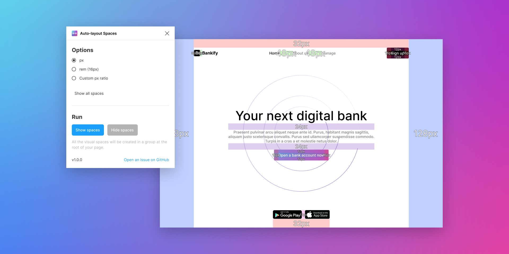

<div align="center">

# Auto-layout Spaces

👀 View all spacing at once in auto-layouts.

➡️ [Install on Figma](https://www.figma.com/community/plugin/1141632283161323116/Auto-layout-Spaces)

</div>

---

## Why

Show all spaces in auto-layouts at once, so that developers integrating the design don’t have to select elements one by one to see their spacing.

## Features

- Show spaces in all of the auto-layouts in the page.
- Hide them.
- Show only spacing between items, or only paddings.
- Choose different units for the value of spaces (`px`, `rem` or a custom pixel ratio).
- Spaces are shown with different colors, each color corresponding to a specific value.

## Running locally

After cloning the repo, install the dependencies via [pnpm](https://pnpm.io/):

```bash
pnpm install
```

You can build the projet once with:

```bash
pnpm build
```

...or watch for changes:

```bash
pnpm watch
```

In Figma, open a file and go to _Figma_ > _Plugins_ > _Development_ > _Import plugin from manifest_ and select the `manifest.json` in the project.

Now, you can run the plugin and do your changes.

## License

[MIT](./LICENSE) © Colin Lienard
